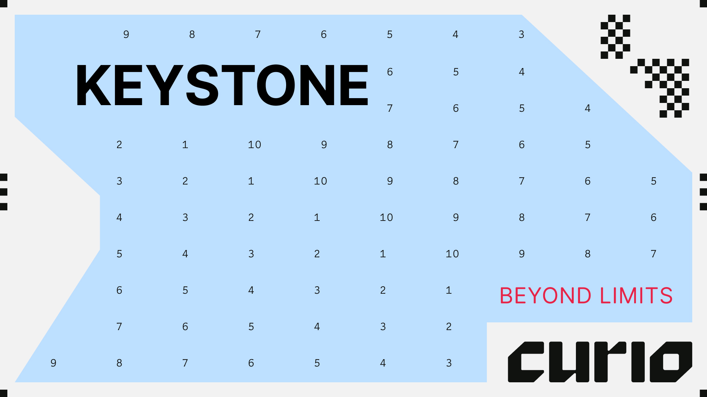
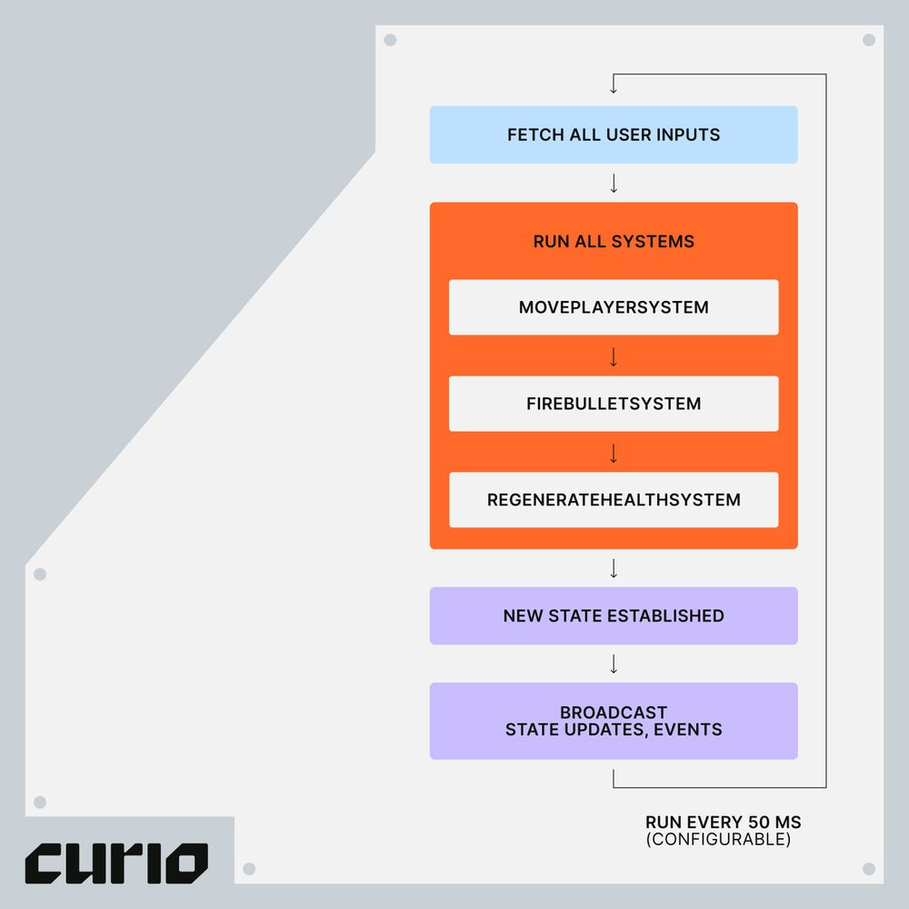

> Keystone is a rollup SDK for building on-chain games hyper focused on performance and composability above all.

```mdx-code-block

import { GithubCard } from '@site/src/components/GithubCard';
import { WebCard } from '@site/src/components/WebCard';
import styles from "@site/src/components/card.module.css"

<div className={styles.Card}>
  <WebCard link="https://www.keystonesdk.com/" title="Keystone Documents"/>
  <GithubCard link="https://github.com/curio-research/keystone" title="Keystone Repository"/>
</div>

```

Keystone is an excellent toolkit designed by the Curio team based on many years of experience in blockchain game development. It is the best toolkit for building high performance and composable onchain games.



The Keystone framework is founded on a "high tick rate" game engine that specifically caters to powering real-time strategy games, e.g. titles like Age of Empires It will support various data availability (DA) layers, starting with Celestia.

:::tip

**`Data Availability`**: Prove data was published to the network

Celestia is a data availability (DA) layer that provides a scalable solution to the [**`data availability problem`**](https://coinmarketcap.com/academy/article/what-is-data-availability). Due to the permissionless nature of the blockchain networks, a DA layer must provide a mechanism for the execution and settlement layers to check in a trust-minimized way whether transaction data is indeed available.

:::

## 👀 Inside Keystone


**Keystone represents a step-function improvement in how onchain games are built. Think of Keystone as a blockchain and a game server enshrined in one unit. It’s designed from grounds up to create a highly performant data oriented game server with the composability of EVM smart contracts.**

### 1. State management

Keystone uses a table-based state management system inspired by ECS. Each entity is associated with a schema struct with full type support in Go. Clients, whether in JavaScript or Unity, can subscribe to automatically sync state with no additional code. We’ve also entirely eliminated the need for an indexer, reducing latency dramatically. Query and subscribe to data streams directly from Keystone.

### 2. Execution

Game logic, organized into systems, is written in Go instead of Solidity, allowing developers to fully leverage existing libraries and 3rd party services while increasing performance drastically. The heartbeat of Keystone is a fast-paced game tick. At each tick, transactions submitted from the last tick are processed via systems. Transactions are executed atomically just like smart contracts, and Keystone can comfortably process tens of thousands of transactions per second with hundreds of ticks per second.



In addition, Keystone supports transaction replay — by deterministically playing back user transactions, developers can instantly rewind the game state back to any point in time — a handy tool for debugging, collecting analytics, and more.

### 3. Plugins

Keystone supports a wide range of plugins for persistent data storage, data availability, and more. We offer out of the box support for SQLite and MySQL solutions for backing up data when game worlds need to be consistent, making it easy to create data pipelines, analytics and logging services. Developers can create custom plugins by following a standard interface.

### 4. EVM
The Keystone EVM and game server is enshrined in a single instance. To do this, we’ve taken the necessary components from Geth and integrated it with the rest of the Keystone server, making the EVM hyper performant and specifically tailored for games. Smart contracts deployed on Keystone can both read and write data from the table-based state through precompiles. We will release more updates on the Keystone EVM soon.

The synthesis between a traditional game server architecture and the battle-tested EVM gives developers a highly performant system while retaining the full composability of smart contracts. We couldn’t be more excited to share this with the world.

> ## 🔐 Reference
>
> [Introducing Keystone](https://blog.curio.gg/introducing-keystone/)
